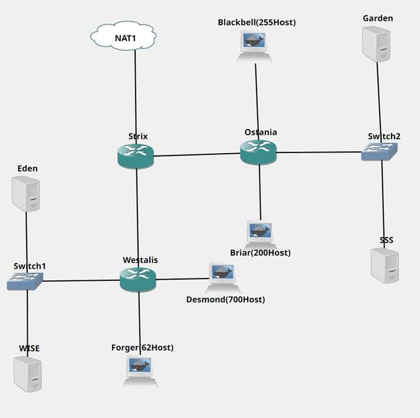
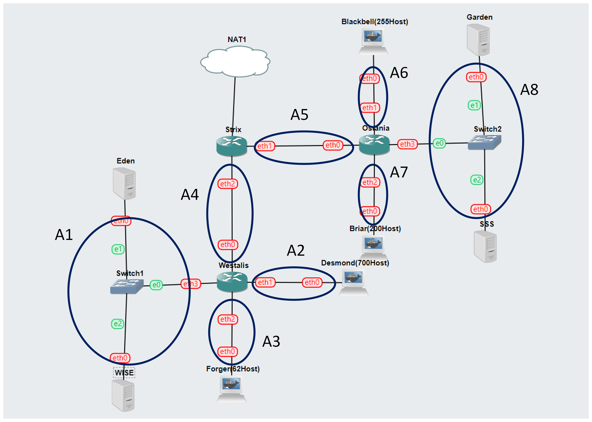

# Jarkom-Modul-5-ITB07-2022
## Laporan Resmi Pengerjaan Sesi Lab Jaringan Komputer 

## Nama Anggota Kelompok :      
1. 5027201004 Alda Risma Harjian 
2. 5027201042 Ilham Muhammad Sakti 
3. 5027201067 Naufal Ramadhan 

## Daftar Isi:
- [Soal](#soal)
- [Cara Pengerjaan](#cara-pengerjaan)
- [Kendala](#kendala)

## Soal
Setelah kalian mempelajari semua modul yang telah diberikan, Loid ingin meminta bantuan untuk terakhir kalinya kepada kalian. Dan kalian dengan senang hati mau membantu Loid.

(A)	Tugas pertama kalian yaitu membuat topologi jaringan sesuai dengan rancangan yang diberikan Loid dibawah ini:<br>
 <br>
Keterangan : <br>	
- Eden adalah DNS Server
- WISE adalah DHCP Server
- Garden dan SSS adalah Web Server
- Jumlah Host pada Forger adalah 62 host
- Jumlah Host pada Desmond adalah 700 host
- Jumlah Host pada Blackbell adalah 255 host
- Jumlah Host pada Briar adalah 200 host

(B)	Untuk menjaga perdamaian dunia, Loid ingin meminta kalian untuk membuat topologi tersebut menggunakan teknik CIDR atau VLSM setelah melakukan subnetting.

(C)	Anya, putri pertama Loid, juga berpesan kepada anda agar melakukan Routing agar setiap perangkat pada jaringan tersebut dapat terhubung.
 
(D)	Tugas berikutnya adalah memberikan ip pada subnet Forger, Desmond, Blackbell, dan Briar secara dinamis menggunakan bantuan DHCP server. Kemudian kalian ingat bahwa kalian harus setting DHCP Relay pada router yang menghubungkannya.
1.	Agar topologi yang kalian buat dapat mengakses keluar, kalian diminta untuk mengkonfigurasi Strix menggunakan iptables, tetapi Loid tidak ingin menggunakan MASQUERADE.
2.	Kalian diminta untuk melakukan drop semua TCP dan UDP dari luar Topologi kalian pada server yang merupakan DHCP Server demi menjaga keamanan.
3.	Loid meminta kalian untuk membatasi DHCP dan DNS Server hanya boleh menerima maksimal 2 koneksi ICMP secara bersamaan menggunakan iptables, selebihnya didrop.
4.	Akses menuju Web Server hanya diperbolehkan disaat jam kerja yaitu Senin sampai Jumat pada pukul 07.00 - 16.00.
5.	Karena kita memiliki 2 Web Server, Loid ingin Ostania diatur sehingga setiap request dari client yang mengakses Garden dengan port 80 akan didistribusikan secara bergantian pada SSS dan Garden secara berurutan dan request dari client yang mengakses SSS dengan port 443 akan didistribusikan secara bergantian pada Garden dan SSS secara berurutan.
6.	Karena Loid ingin tau paket apa saja yang di-drop, maka di setiap node server dan router ditambahkan logging paket yang di-drop dengan standard syslog level.
Loid berterima kasih pada kalian karena telah membantunya. Loid juga mengingatkan agar semua aturan iptables harus disimpan pada sistem atau paling tidak kalian menyediakan script sebagai backup.

## Cara Pengerjaan
### Jawaban A-C
#### Perhitungan VLSM
Berikut topologi dan pembagian subnet. <br>
 <br>

Berikut tabel perhitungan. <br>

| Subnet Name   | Needed Size   | Allocated Size | Address      | Mask  | Subnet Mask       | Assignable Range | Broadcast |
|---------------|---------------|----------------|--------------|-------|-------------------|------------------|-----------|
| A2            | 701           | 1022           | 10.48.0.0    | /22   | 255.255.252.0     | 10.48.0.1 - 10.48.3.254 | 10.48.3.255|
| A6            | 256           | 510            | 10.48.4.0    | /23   | 255.255.254.0     | 10.48.4.1 - 10.48.5.254 | 10.48.5.255|
| A7            | 201           | 254            | 10.48.6.0    | /24   | 255.255.255.0     | 10.48.6.1 - 10.48.6.254 | 10.48.6.255|
| A3            | 63            | 126            | 10.48.7.0    | /25   | 255.255.255.128   | 10.48.7.1 - 10.48.7.62  | 10.48.7.63 |
| A1            | 3             | 6              | 10.48.7.64   | /29   | 255.255.255.248   | 10.48.7.65 - 10.48.7.70 | 10.48.7.71 |
| A8            | 3             | 6              | 10.48.7.72   | /29   | 255.255.255.248   | 10.48.7.73 - 10.48.7.78 | 10.48.7.79 |
| A4            | 2             | 2              | 10.48.7.80   | /30   | 255.255.255.252   | 10.48.7.81 - 10.48.7.82 | 10.48.7.83 |
| A5            | 2             | 2              | 10.48.7.84   | /30   | 255.255.255.252   | 10.48.7.85 - 10.48.7.86 | 10.48.7.87 |
| Host yang dibutuhkan    		| 1232 (/21) |               

#### Konfigurasi Network pada setiap Node
[Strix]
```bash
auto eth0
iface eth0 inet dhcp

auto eth1
iface eth1 inet static
	address 10.48.7.85
	netmask 255.255.255.252

auto eth2
iface eth2 inet static
	address 10.48.7.81
	netmask 255.255.255.252
```
[Westalis]
```bash
auto eth0
iface eth0 inet static
	address 10.48.7.82
	netmask 255.255.255.252
auto eth1
iface eth1 inet static
	address 10.48.0.1
	netmask 255.255.254.0
auto eth2
iface eth2 inet static
	address 10.48.7.1
	netmask 255.255.255.128
auto eth3
iface eth3 inet static
	address 10.48.7.65
	netmask 255.255.255.248
```
[Ostania]
```bash
auto eth0
iface eth0 inet static
	address 10.48.7.86
	netmask 255.255.255.252
auto eth1
iface eth1 inet static
	address 10.48.4.1
	netmask 255.255.254.0
auto eth2
iface eth2 inet static
	address  10.48.6.1
	netmask 255.255.255.0
auto eth3
iface eth3 inet static
	address  10.48.7.73
	netmask 255.255.255.248
```
[Forger],[Desmond],[Blackbell],[Briar]
```bash
auto eth0
iface eth0 inet dhcp
```
[Eden]
```bash
auto eth0
iface eth0 inet static
	address 10.48.7.66
	netmask 255.255.255.248
    gateway 10.48.7.65
```
[WISE]
```bash
auto eth0
iface eth0 inet static
	address 10.48.7.67
	netmask 255.255.255.248
    gateway 10.48.7.65
```
[Garden]
```bash
auto eth0
iface eth0 inet static
	address 10.48.7.74
	netmask 255.255.255.248
    gateway 10.48.7.73
```
[SSS]
```bash
auto eth0
iface eth0 inet static
	address 10.48.7.75
	netmask 255.255.255.248
    gateway 10.48.7.73
```

#### Routing dan Konfigurasi DNS, Web server, DHCP Server, dan DHCP relay
[Strix]
```bash
route add -net 10.48.7.0 netmask 255.255.255.128 gw 10.48.7.82 #Forger
route add -net 10.48.0.0 netmask 255.255.252.0 gw 10.48.7.82 #Desmond
route add -net 10.48.7.64 netmask 255.255.255.248 gw 10.48.7.82 #Eden & WISE

route add -net 10.48.4.0 netmask 255.255.254.0 gw 10.48.7.86 #Blackbell
route add -net 10.48.6.0 netmask 255.255.255.0 gw 10.48.7.86 #Briar
route add -net 10.48.7.72 netmask 255.255.255.248 gw 10.48.7.86 #Garden & SSS
```
[Westalis]
```bash
route add -net 0.0.0.0 netmask 0.0.0.0 gw 10.48.7.81
```
[Ostania]
```bash
route add -net 0.0.0.0 netmask 0.0.0.0 gw 10.48.7.85
```
[Eden sebagai DNS Server] <br>
Edit file /etc/bind/named.conf.options dan lakukan restart dengan `service bind9 restart`.
```bash
apt update
apt install bind9 -y
echo '
options {
        directory "/var/cache/bind";
        forwarders {
                192.168.122.1;
        };
        allow-query { any; };
        auth-nxdomain no;    # conform to RFC1035
        listen-on-v6 { any; };
};
'> /etc/bind/named.conf.options
```
[WISE sebagai DHCP Server] <br>
Edit file /etc/default/isc-dhcp-server 
```bash
apt update
apt install isc-dhcp-server -y
echo '
INTERFACES="eth0"
'> /etc/default/isc-dhcp-server 
```
Edit file /etc/dhcp/dhcpd.conf
```bash
echo '
ddns-update-style none;
option domain-name "example.org";
option domain-name-servers ns1.example.org, ns2.example.org;
default-lease-time 600;
max-lease-time 7200;
log-facility local7;
subnet 10.48.0.0 netmask 255.255.252.0 {
    range 10.48.0.2 10.48.3.254;
    option routers 10.48.0.1;
    option broadcast-address 10.48.3.255;
    option domain-name-servers 10.48.7.66;
    default-lease-time 360;
    max-lease-time 7200;
}
subnet 10.48.7.0 netmask 255.255.255.128 {
    range 10.48.7.2 10.48.7.62;
    option routers 10.48.7.1;
    option broadcast-address 10.48.7.63;
    option domain-name-servers 10.48.7.66;
    default-lease-time 720;
    max-lease-time 7200;
}
subnet 10.48.4.0 netmask 255.255.254.0 {
    range 10.48.4.2 10.48.5.254;
    option routers 10.48.4.1;
    option broadcast-address 10.48.5.255;
    option domain-name-servers 10.48.7.66;
    default-lease-time 720;
    max-lease-time 7200;
}
subnet 10.48.6.0 netmask 255.255.255.0 {
    range 10.48.6.2 10.48.6.254;
    option routers 10.48.6.1;
    option broadcast-address 10.48.6.255;
    option domain-name-servers 10.48.7.66;
    default-lease-time 720;
    max-lease-time 7200;
}
subnet 10.48.7.64 netmask 255.255.255.248 {}
subnet 10.48.7.80 netmask 255.255.255.252 {}
subnet 10.48.7.84 netmask 255.255.255.252 {}
subnet 10.48.7.72 netmask 255.255.255.248 {}
'> /etc/dhcp/dhcpd.conf
```
lakukan restart dengan `service bind9 restart`. <br>

[Ostania sebagai DHCP Relay] <br>
```bash
apt update
apt install isc-dhcp-relay -y
echo '
SERVERS="10.48.7.67"
INTERFACES="eth2 eth3 eth1 eth0"
OPTIONS=""
' > /etc/default/isc-dhcp-relay
service isc-dhcp-relay restart
```

[Westalis sebagai DHCP Relay] <br>
```bash
apt update
apt install isc-dhcp-relay -y
echo '
SERVERS="10.48.7.67"
INTERFACES="eth2 eth3 eth0 eth1"
OPTIONS=""
' > /etc/default/isc-dhcp-relay
```
service isc-dhcp-relay restart

[Garden dan SSS adalah Web Server] <br>
```bash
apt update
apt install apache2 -y
service apache2 start
echo "$HOSTNAME" > /var/www/html/index.html
```

### Jawaban D.1
[Strix] <br>
```bash
IPETH0="$(ip -br a | grep eth0 | awk '{print $NF}' | cut -d'/' -f1)"
iptables -t nat -A POSTROUTING -o eth0 -j SNAT --to-source "$IPETH0" -s 10.48.0.0/21
```
### Jawaban D.2
[Strix] <br>
```bash
iptables -A FORWARD -d 10.48.7.67 -i eth0 -p tcp --dport 80 -j DROP
iptables -A FORWARD -d 10.48.7.67 -i eth0 -p tcp --dport 80 -j DROP
```

### Jawaban D.3
[WISE] <br>
Reject bila terdapat PING ICMP Lebih dari 2 <br>
```bash
iptables -A INPUT -p icmp -m connlimit --connlimit-above 2 --connlimit-mask 0 -j DROP
```
[Eden] <br>
Reject bila terdapat PING ICMP Lebih dari 2 <br>
```bash
iptables -A INPUT -p icmp -m connlimit --connlimit-above 2 --connlimit-mask 0 -j DROP
```

### Jawaban D.
[Eden] <br>
[Forger] <br>
```bash
iptables -A INPUT -s 10.48.7.0/25 -m time --weekdays Sat,Sun -j REJECT
iptables -A INPUT -s 10.48.7.0/25 -m time --timestart 00:00 --timestop 06:59 --weekdays Mon,Tue,Wed,Thu,Fri -j REJECT
iptables -A INPUT -s 10.48.7.0/25 -m time --timestart 16:01 --timestop 23:59 --weekdays Mon,Tue,Wed,Thu,Fri -j REJECT
```
[Desmond] <br>
```bash
iptables -A INPUT -s 10.48.0.0/22 -m time --weekdays Sat,Sun -j REJECT
iptables -A INPUT -s 10.48.0.0/22 -m time --timestart 00:00 --timestop 06:59 --weekdays Mon,Tue,Wed,Thu,Fri -j REJECT
iptables -A INPUT -s 10.48.0.0/22 -m time --timestart 16:01 --timestop 23:59 --weekdays Mon,Tue,Wed,Thu,Fri -j REJECT
```

## Kendala
Cukup kesulitan dalam routing karena kurang teliti.